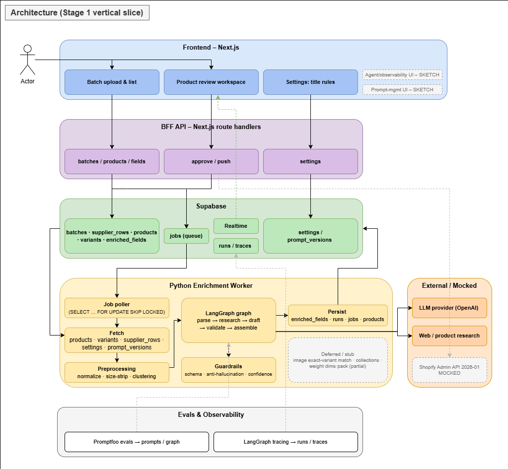
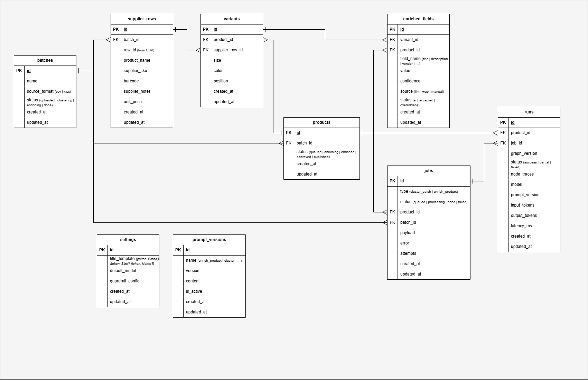

# Supplier → Shopify Enrichment

Takes thin, messy supplier rows and produces structured, publish-ready Shopify
product listings that a human reviewer inspects, corrects, and approves before
publishing. This repo is the **Stage 1 vertical slice**: the core
`enrich → human review → publish` loop.

## Architecture

[](docs/ARCHITECTURE.md)

[](docs/DATABASE.md)

- **Architecture:** [`docs/ARCHITECTURE.md`](docs/ARCHITECTURE.md)
- **Database schema:** [`docs/DATABASE.md`](docs/DATABASE.md)
- **Monorepo conventions:** [`docs/MONOREPO.md`](docs/MONOREPO.md)

## Layout

```
apps/
  web/        Next.js (App Router): reviewer UI + BFF route handlers
  worker/     Python + LangGraph enrichment worker (uv-managed)
packages/
  db/         @repo/db — generated Supabase TS types + domain aliases
  config-ts/  shared tsconfig presets
  config-eslint/ shared ESLint config
supabase/     Supabase CLI project: migrations (schema source of truth) + seed
evals/        Promptfoo configs + datasets
data/         sample supplier inputs
```

## Prerequisites

| Tool | Version | Notes |
|------|---------|-------|
| Node.js | 20+ | see `.node-version` |
| pnpm | 11+ | JS workspace package manager |
| Python | 3.12+ | worker runtime |
| [uv](https://docs.astral.sh/uv/) | latest | Python dependency manager |
| Docker | — | required to run the local Supabase stack |
| [go-task](https://taskfile.dev) | latest | task runner (the `task` commands below) |

The Supabase CLI is **not** a global install — it ships as a pinned dev
dependency and every task invokes it as `pnpm exec supabase …`, so everyone uses
the same version.

## Getting started

```bash
# Local Supabase (needs Docker) — .env, installs, DB up + migrated, types:
task setup

# …or against a hosted Supabase project instead:
task setup:cloud

# Then add OPENAI_API_KEY (or ANTHROPIC_API_KEY) to .env and run both apps:
task dev          # web → http://localhost:3000  +  enrichment worker
```

`task setup` auto-populates the local Supabase URL, keys, and `DATABASE_URL` in
`.env` — no manual copying. For `task setup:cloud`, set those three keys from the
Supabase dashboard yourself; everything else in `.env` is annotated in
`.env.example`.

> The Stage 1 vertical slice is implemented end to end: upload, queue,
> enrichment graph, reviewer UI, approve/push flow, and mocked Shopify publish.
> Some later-stage surfaces are still deferred, especially richer eval datasets,
> prompt-management UI, and a dedicated observability UI. See
> [`docs/ARCHITECTURE.md`](docs/ARCHITECTURE.md) for what is built vs. deferred.

## Tasks

Run `task --list` for the full set with descriptions. The common ones:

| Task | What it does |
|------|--------------|
| `task setup` | Local onboarding: `.env`, installs, Supabase up, migrate + seed, types |
| `task setup:cloud -- <ref>` | Same, linked to a hosted Supabase project |
| `task dev` | Run the web app **and** worker together |
| `task web` / `task worker` | Run just one of them |
| `task install` | Install everything (JS workspace + Python worker) |
| `task db:start` / `db:stop` / `db:status` | Manage the local Supabase stack |
| `task db:reset` | Re-apply all local migrations + `seed.sql` |
| `task db:migration -- <name>` | Create a new empty migration |
| `task db:migrate` | Push local migrations to the linked remote project |
| `task gen:types` | Regenerate the Supabase TypeScript types in `@repo/db` |
| `task lint` / `type-check` / `build` | Individual JS checks |
| `task check` | Full local pre-PR gate (mirrors CI) |

Supabase Studio is at http://127.0.0.1:54323 once the local stack is up.

## Type safety & schema

The SQL migrations under `supabase/` are the single source of truth for the
schema. TypeScript types are generated from them into `@repo/db` (`task
gen:types`), and the worker's Pydantic models are kept in sync by a contract
test. See [`docs/MONOREPO.md`](docs/MONOREPO.md#type-loading) for details.

## CI

`.github/workflows/ci.yml` runs on every PR: JS lint/type-check/build, a
Supabase migration apply + TS type-drift check, and the worker's
lint/type-check/test suite. `task check` runs the same gate locally.
